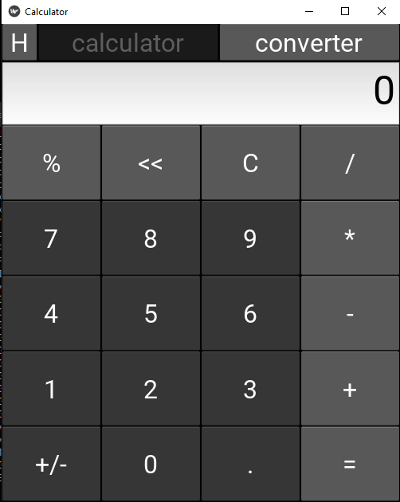
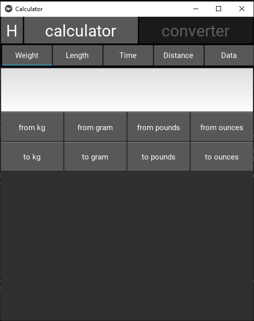
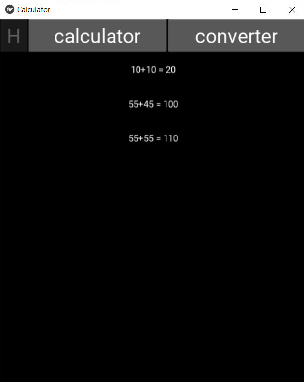

# <h1 style="text-align:center">Calculator</h1>

<p>It's a full functioning calculator with a converter app made using python and kivy framework</p>

- - -

## Features
 * Calculations
 * Converter
 * History

- - -

## Screeshots




- - -

## How to use it
```bash
pip install kivy==2.0.0

python main.py
```
- - -

## Contribution
<p>Everyone is welcomed to contribute to this project. You can contribute either by submitting bugs or suggesting improvements by opening an [issue on GitHub](https://github.com/AkuSarma/kivy_initiator/issues). You can also open a [pull request](https://github.com/AkuSarma/kivy_initiator/pulls) if you can fix any of the bug you found or is already mentioned in open issues</p>
